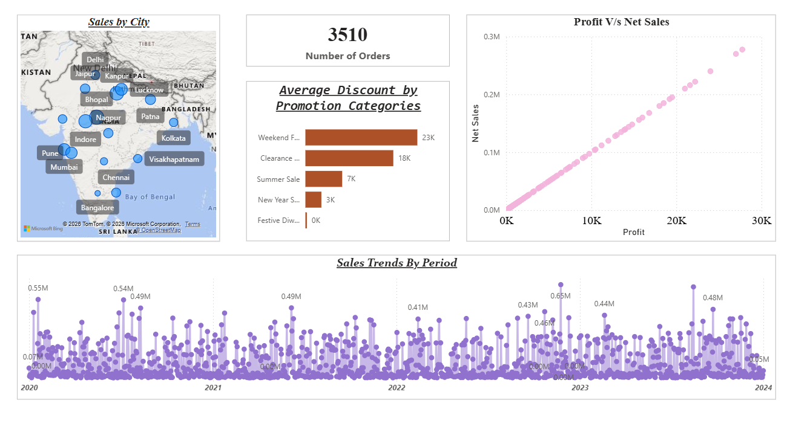
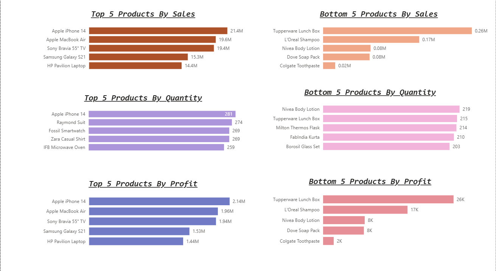
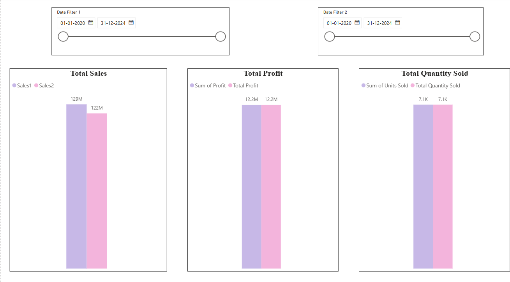
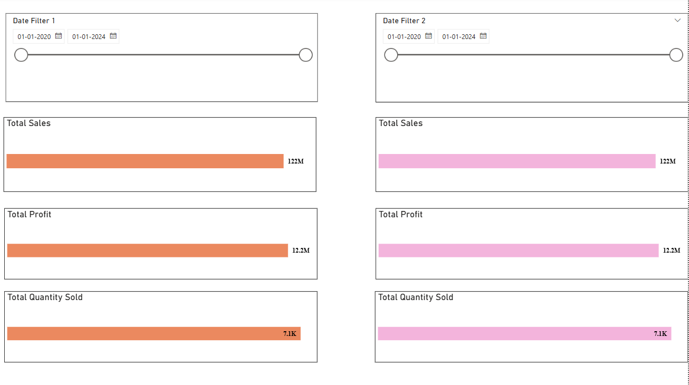
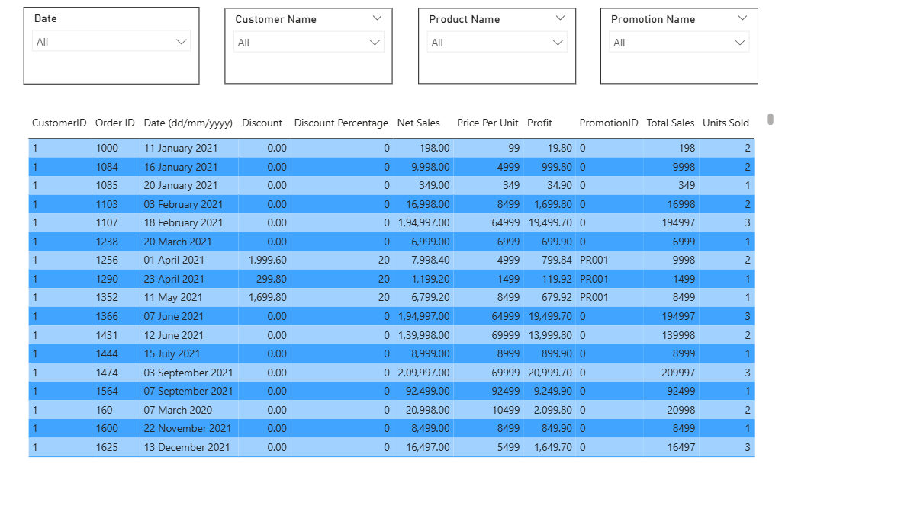

# 📊 Sales Data Analysis Dashboard (Power BI)

## 📌 Project Overview
This Power BI dashboard provides a comprehensive analysis of **sales, profit, quantity, and customer behavior** across different cities, products, and promotional categories.  

---

## 📷 Dashboard Screenshots

### 🔹 Overview

---

### 🔹 Top & Bottom 5 Analysis

---

### 🔹 Comparison Dashboard

---

### 🔹 Edit Interactions

---

### 🔹 Table Visual

---

## 🎯 Key Features

### 📍 Sales by City
- Interactive map visualization
- Shows sales distribution across cities  

### 📦 Orders Summary
- **Total Orders:** `3510`

### 🏷️ Discount Analysis
- Weekend Offers  
- Clearance Sales  
- Summer Sale  
- New Year Sale  
- Festive Discounts  

### 📈 Profit vs Net Sales
- Scatter plot showing relationship between profit & sales  

### 📅 Sales Trends (2020–2024)
- Identifies seasonal patterns and growth  

---

## 🏆 Product Performance Analysis

### 🔝 Top 5 Products by Sales
- Apple iPhone 14  
- Apple MacBook Air  
- Sony Bravia 55" TV  
- Samsung Galaxy S21  
- HP Pavilion Laptop  

### 📉 Bottom 5 Products by Sales
- Tupperware Lunch Box  
- L'Oreal Shampoo  
- Nivea Body Lotion  
- Dove Soap Pack  
- Colgate Toothpaste  

---

## 📊 KPI Metrics

| Metric | Value |
|-------|------|
| Total Sales | 122M |
| Total Profit | 12.2M |
| Total Quantity Sold | 7.1K |

---

## 🎛️ Filters
- Date Range Filter  
- Customer Name  
- Product Name  
- Promotion Name  

---

## 🛠️ Tools Used
- Power BI  
- DAX  
- Data Modeling  

---

## 👩‍💻 Author
**Tishtha Gandhi**
